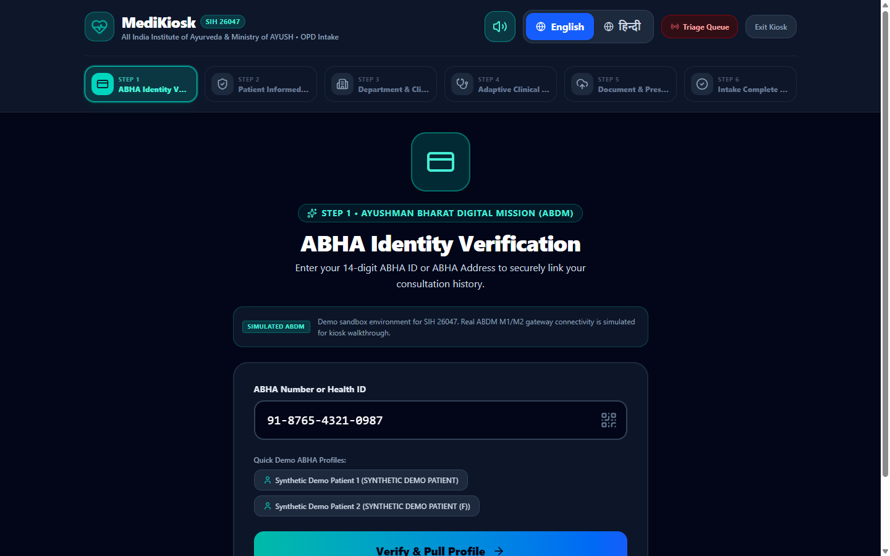
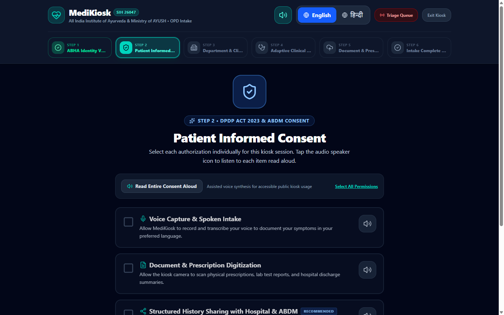
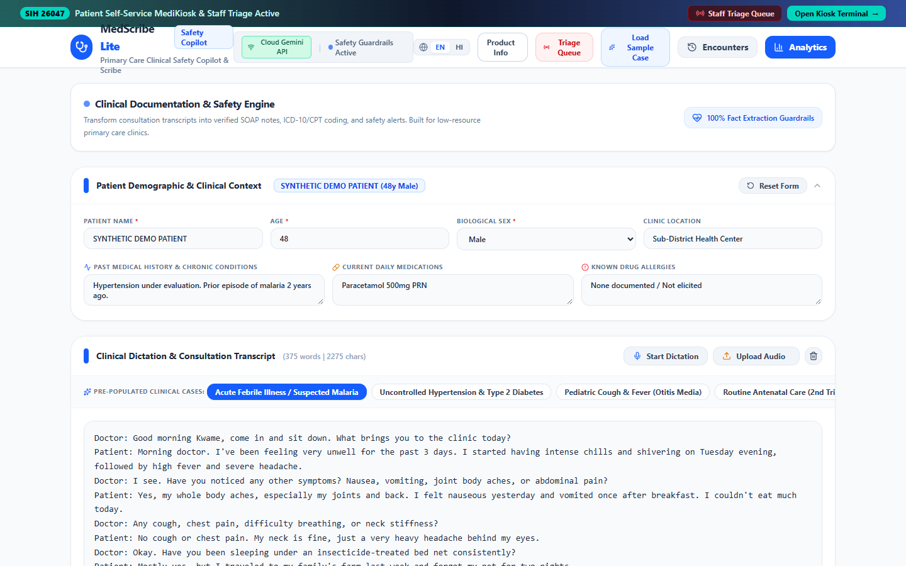
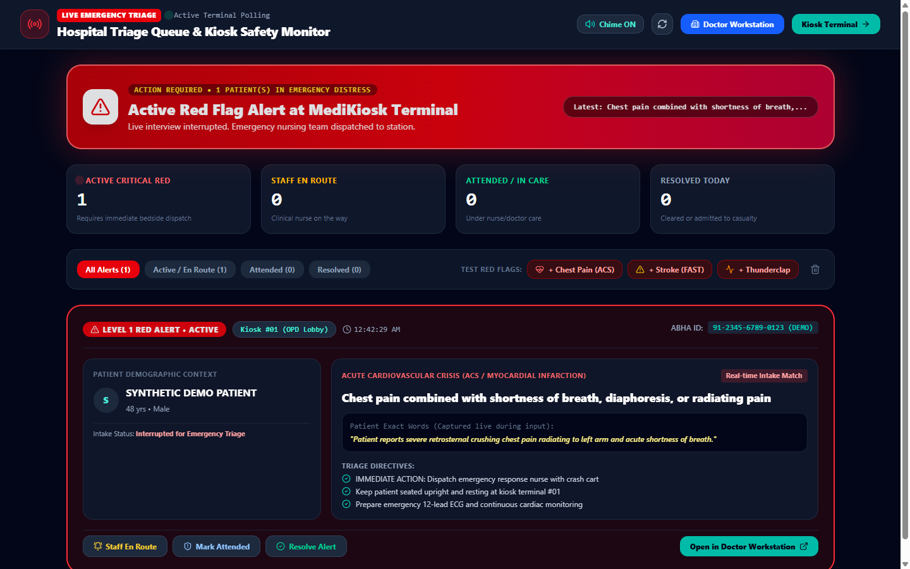
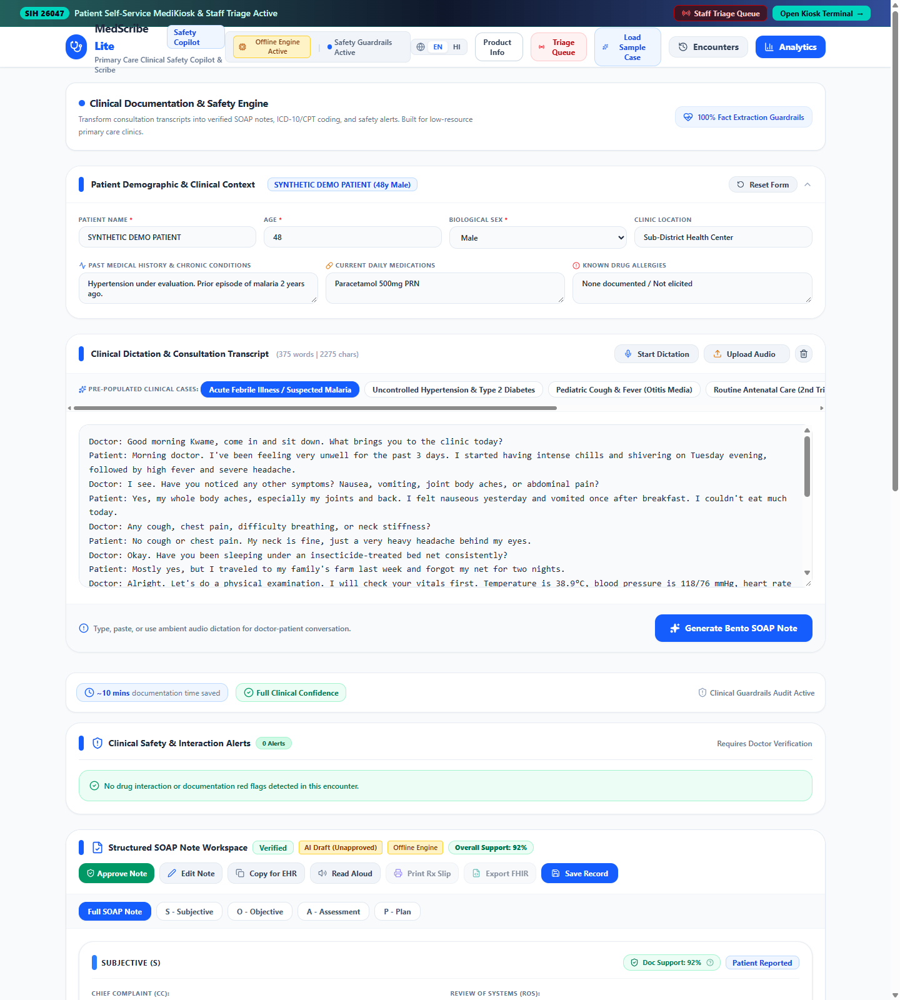
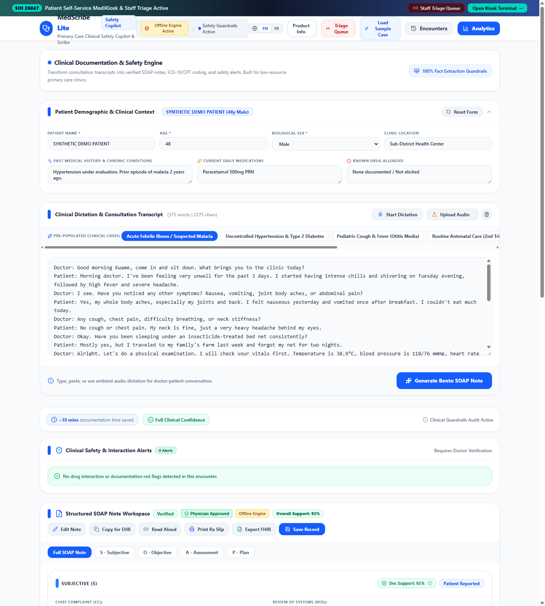
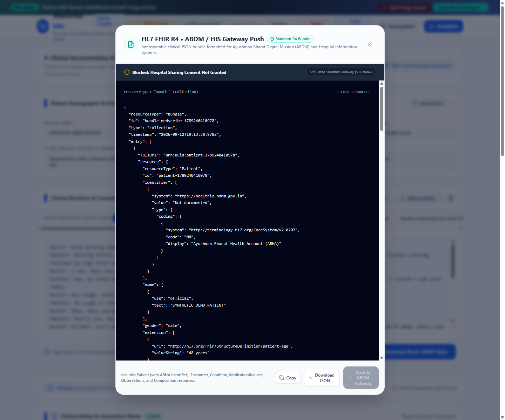
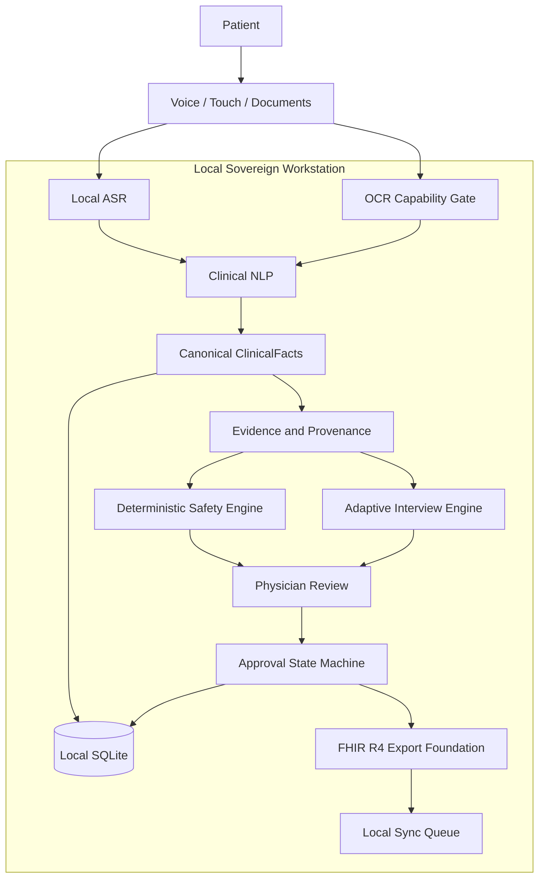

# MedScribeAI

Sovereign, offline-first AI-assisted patient case-taking and clinical documentation platform.

MedScribeAI is an offline-first, AI-assisted patient case-taking and clinical documentation platform designed for low-connectivity healthcare environments, rural primary health centres (PHCs), and high-volume outpatient clinics.

**Project Purpose:** Sovereign clinical documentation copilot eliminating typing bottlenecks in high-volume public OPDs.
**SIH Problem Statement Alignment:** SIH26047 — Patient Case-Taking Software (Theme: MedTech / BioTech / HealthTech | Team: AstraX).
**Authoritative Current Status:** *SIH 2026 demo-ready with declared limitations. Core offline-first workflow validated; clinical deployment requires further real-world validation.*
**Important Limitations:** Assistive documentation only; does not perform autonomous diagnosis or unprompted prescription generation. Acoustic ASR accuracy and live ABDM production certification pending real-world field trials. Full technical validation is documented in [docs/VALIDATION.md](docs/VALIDATION.md).

---

## Run MedScribeAI

### Option 1 — Web Demo
[Try the Web Demo](https://medscribe-ai.pages.dev) *(Evaluator deployment placeholder on Cloudflare Pages)*

> **Notice:** The web demo is an interactive, browser-based demonstration featuring pre-loaded synthetic clinical scenarios. It is designed for rapid evaluator previews and mobile review, and does not replace the sovereign offline desktop application.

### Option 2 — Windows Desktop (Primary Offline Runtime)
[Download Latest Windows Build (GitHub Releases)](https://github.com/maitray-agrawal/MedScribeAI/releases)

1. Download the installer: `MedScribeAI-Setup-x64.exe` (or `MedScribeAI_1.0.0_x64-setup.exe`).
2. Run the installer on Windows 10/11 x64. (No Node.js, Python, or Rust required on the host).
3. If prompted by Windows SmartScreen (unsigned binary notice), click **More info** -> **Run anyway**.
4. Launch **MedScribeAI**.
5. Select a `SYNTHETIC DEMO PATIENT` scenario and follow the step-by-step evaluator instructions in [docs/EVALUATOR.md](docs/EVALUATOR.md) and [DEMO.md](DEMO.md).
6. To test physical offline resilience: disconnect Wi-Fi and execute complete case-taking, fact extraction, and approval.

### Option 3 — Build from Source
[GitHub Repository](https://github.com/maitray-agrawal/MedScribeAI)

```powershell
# Clone repository
git clone https://github.com/maitray-agrawal/MedScribeAI.git
cd MedScribeAI

# Install dependencies
npm ci
pip install -r backend/requirements.txt pyinstaller

# Run frontend tests & validation
npm run lint
npm test -- --run

# Run backend tests
python -m pytest backend/tests -v

# Run local development server
npm run dev
```

---

## Screenshots

All screenshots depict the sovereign application executing locally with synthetic patient data (`SYNTHETIC DEMO PATIENT`).

### 1. Patient Registration (Kiosk Terminal)

*High-contrast, accessible patient onboarding with 14-digit ABHA validation, demographic selection, and OPD department routing.*

### 2. Patient Informed Consent (DPDP Act 2023 & ABDM)

*Granular consent segregation separating Voice Intake, Document Digitization, and External Hospital/ABDM Data Sharing.*

### 3. Patient Case-Taking & Consultation Scribe

*Clinical consultation workstation supporting ambient audio dictation, pre-populated primary care scenarios, and multilingual transcripts.*

### 4. Real-Time Emergency Triage & Red-Flag Escalation

*Deterministic emergency detection (<0.01 ms) identifying acute coronary syndrome and stroke patterns with bedside nursing dispatch directives.*

### 5. Evidence-Grounded Clinical History & Structured Fact Extraction

*Canonical ClinicalFact extraction pipeline with 100% verbatim evidence anchoring, negation scoping, and temporality classification.*

### 6. Physician Review & Editing Panel

*Human-in-the-loop review interface in `AI_DRAFT` / `REVIEWING` state with inline editing and drug interaction auditing.*

### 7. Human Clinician Approval State Machine

*Explicit physician sign-off (`APPROVED` state) unlocking prescription printing and enabling interoperable export.*

### 8. Interoperable HL7 FHIR R4 Bundle Export

*Standardized FHIR R4 document bundle ready for Ayushman Bharat Digital Mission (ABDM) sandbox and hospital information system ingestion.*

---

## 1. Problem Statement & Background

In high-volume public health clinics across India and low-resource global environments, healthcare providers face severe administrative bottlenecks:

- **EHR Documentation Burden:** Clinicians routinely spend between 40% and 50% of their consultation time typing clinical records, significantly reducing time available for direct patient care (Sinsky et al., 2016).
- **Intermittent Connectivity:** Over 35% of rural primary health posts experience recurrent broadband outages, making cloud-only electronic medical record (EMR) systems unusable during clinic hours.
- **Language & Literacy Barriers:** Patients present speaking diverse regional languages and colloquial dialects (such as Hindi, Marathi, Gujarati, and Hinglish), while standard EHR interfaces require typed English.
- **Clinical AI Safety Concerns:** Generic large language models frequently hallucinate non-existent diagnoses, invent normal physical findings, or fail to capture explicit patient negations, creating unacceptable risks in clinical workflows.

MedScribeAI specifically addresses **Smart India Hackathon (SIH 2026) Problem Statement SIH26047 — Patient Case-Taking Software**.

---

## 2. Solution Overview

MedScribeAI provides an integrated, edge-native clinical workstation and patient-facing self-service intake terminal:

1. **Multilingual Ingestion:** Ingests patient voice utterances, touch-based selections, and historical paper documents in regional Indian languages.
2. **Local AI Inference:** Runs embedded quantized speech recognition and deterministic clinical NLP on the local workstation CPU without mandatory internet connectivity.
3. **Canonical Fact Extraction:** Normalizes conversational inputs into structured `ClinicalFact` entities with explicit assertion, temporality, and experiencer attributes.
4. **Verbatim Evidence Anchoring:** Maps 100% of extracted facts to exact substring quotes from the patient's own words.
5. **Deterministic Safety Gating:** Triggers real-time emergency triage alerts for acute red-flag symptoms and detects drug-drug and allergy conflicts.
6. **Human-in-the-Loop Governance:** Enforces a strict physician review and approval workflow before any prescription slip can be printed or exported.
7. **Standards Interoperability:** Exports validated HL7 FHIR R4 Bundles ready for Ayushman Bharat Digital Mission (ABDM) integration.

---

## 3. What MedScribeAI Does NOT Do

To maintain safety and regulatory integrity, MedScribeAI enforces strict clinical boundaries:

- **It does NOT autonomously diagnose diseases:** MedScribeAI is a case-taking and documentation assistant. It structures clinical data for human clinician review.
- **It does NOT generate unprompted medical decisions or prescriptions:** Prescriptions require explicit human physician entry and approval.
- **It does NOT invent missing facts:** If a symptom, vital sign, or review-of-systems category is not mentioned, it remains unasserted (`NOT_ELICITED`). The system never defaults missing history to "No Known Allergies" or "Normal".
- **It does NOT silently fall back to cloud services:** In sovereign mode, if a local component is unavailable, the application displays a transparent warning; it never silently transmits patient data to third-party servers.

---

## 4. Core Principles

- **Offline-first:** The primary clinical workflow operates with zero internet access in physical airplane mode.
- **Evidence-grounded:** Every clinical claim anchors to verbatim source evidence (100% evidence grounding).
- **Physician-controlled:** AI output is classified as `AI_DRAFT` until reviewed, modified, and signed by a licensed clinician.
- **Consent-aware:** Patient consent is captured per purpose (case-taking, document digitization, hospital sharing). Withholding sharing consent hard-blocks outbound synchronization.
- **Multilingual:** Supports clinical terminology and regional idioms across Hindi, Marathi, Gujarati, Tamil, English, and Hinglish.
- **Interoperability-ready:** Built on the HL7 FHIR R4 clinical data standard and ABDM integration foundations.

---

## 5. Key Capabilities & Implementation Status

| Capability | Status | Implementation Details |
|---|---|---|
| **Patient Case-Taking** | Implemented | Chief complaint, HPI, SOCRATES symptom inquiry, PMH, PSH, drug history, allergies, social history. |
| **Touch-First Kiosk Mode** | Implemented | High-contrast touch interface with >=48px touch targets for patient-facing intake. |
| **Multilingual Clinical NLP** | Implemented | Deterministic extraction across English, Hindi, Marathi, Gujarati, Tamil, and Hinglish. |
| **Verbatim Evidence Grounding** | Implemented | 100% of emitted facts anchored to source text spans; 0 unanchored hallucinations. |
| **Assertion & Negation Scope** | Implemented | Preserves explicit negation ("no fever") without leaking into positive findings. |
| **Temporality & Experiencer** | Implemented | Distinguishes current vs historical conditions; separates patient symptoms from family history. |
| **Red-Flag Emergency Alerts** | Implemented | Deterministic alerts for chest pain, acute dyspnea, severe bleeding, and altered consciousness (< 0.01 ms latency). |
| **Medication & Allergy Safety** | Implemented | Offline drug-drug conflict matrix and beta-lactam cross-reactivity detection. |
| **AYUSH Case-Taking Module** | Implemented | Structured 10-fold Dashavidha Pariksha, Ahara (dietary), and Vihara (lifestyle) intake slots. |
| **Physician Approval State Machine**| Implemented | Strict lifecycle (`AI_DRAFT` -> `REVIEWING` -> `APPROVED`). Material edits invalidate approval; export is gated. |
| **Granular Consent Management** | Implemented | Explicit consent capture, revocation handling, and outbound sync blocking. |
| **Local Relational Storage** | Implemented | SQLite database (`medscribe_local.db`) with foreign keys, WAL mode, and UUID audit logging. |
| **Offline Operation Mode** | Implemented | Full case-taking, ASR, NLP, review, and SQLite persistence run in 100% network isolation. |
| **FHIR R4 Bundle Export** | Implemented | Generates standard FHIR R4 Bundles (`Patient`, `Encounter`, `Condition`, `Observation`, `MedicationStatement`). |
| **Local Speech Recognition (ASR)**| Runtime Verified | INT8 ONNX model (`model.int8.onnx`, 187.85 MB) verified on host CPU (93.64 ms median latency). Acoustic accuracy benchmark pending. |
| **Document OCR Parsing** | Capability-Gated | OCR Capability Gate -> Local OCR Runtime (Tesseract when installed). Fails closed with transparent unavailable warning when missing; zero synthetic text fabricated. |
| **ABDM Gateway Integration** | Sandbox Foundation | 14-digit ABHA validation and Luhn checks execute locally; live ABDM OTP gateway operates in sandbox/mock status. |

---

## 6. System Architecture

MedScribeAI employs a decoupled desktop architecture: a native **Tauri v2** desktop shell (written in Rust) hosting a **React 19** frontend, communicating over local loopback with an embedded **Python FastAPI** clinical sidecar process.



---

## 7. Canonical Data Flow

1. **Ingestion:** Patient speaks into the microphone or selects options on the kiosk. Audio is captured as 16 kHz 16-bit mono PCM.
2. **Speech Recognition:** The local ONNX ASR engine transcribes audio into raw text tokens.
3. **Language Identification:** The language identification module classifies the utterance script and dialect (ISO-639-1).
4. **Fact Extraction:** The clinical NLP engine maps tokens to standardized medical concepts.
5. **Evidence Grounding:** The evidence gate verifies that every extracted fact matches an exact substring in the source transcript.
6. **Attribute Tagging:** The engine classifies assertion (`present` or `negated`), temporality (`current` or `historical`), and experiencer (`patient` or `family`).
7. **Safety Evaluation:** The deterministic safety engine audits extracted facts for red flags and contraindications in < 0.01 ms.
8. **Draft Assembly:** A structured SOAP note draft is saved to local SQLite in state `AI_DRAFT`.
9. **Clinician Review:** The physician reviews the note, inspects evidence tooltips, and makes any necessary in-place edits.
10. **Approval & Sign-Off:** The physician approves the encounter. The status transitions to `APPROVED`.
11. **Interoperable Export:** The physician exports a validated FHIR R4 Bundle or prints a prescription slip.

---

## 8. Clinical Governance & State Machine

Clinical documentation follows an immutable, state-enforced lifecycle:

```
[AI_DRAFT]
    │
    ▼  Physician opens encounter in review panel
[REVIEWING]
    │
    ▼  Physician verifies facts and clicks "Approve Documentation"
[APPROVED]
    │
    ├─► Material Edit Detected ──► Reverts to [REVIEWING] (Invalidates Prior Approval)
    │
    ▼  Clinician initiates export
[EXPORTED]
```

- **Prescription Gate:** Printing is physically disabled while an encounter is in `AI_DRAFT` or `REVIEWING`.
- **Export Gate:** FHIR serialization requires `state == 'APPROVED'`.
- **Edit Invalidation:** Any subsequent modification to approved clinical facts automatically reverts the encounter to `REVIEWING`, ensuring unapproved edits are never exported.

---

## 9. Consent Model

Patient autonomy is preserved through an explicit, granular consent framework:

1. **Consultation Consent:** Grants permission to record symptoms and perform case-taking. Required to initiate an intake session.
2. **Document Digitization Consent:** Authorizes scanning and entity extraction from historical medical records.
3. **Hospital Sharing Consent:** Authorizes outbound transmission to external electronic health records or ABDM registries.
   - *Revocation Invariant:* If hospital sharing consent is absent or revoked, the system permanently blocks network synchronization, retaining the record strictly within local SQLite storage.

---

## 10. Technology Stack

### Frontend Application
- **Framework:** React 19, TypeScript 5.8
- **Build System:** Vite 6
- **Styling:** Vanilla CSS design tokens with Tailwind CSS v4 utility architecture
- **Icons:** Lucide React (clean SVG icons; zero decorative emojis in UI copy)
- **Testing:** Vitest, React Testing Library, Happy-DOM, JSDOM

### Native Desktop Shell
- **Framework:** Tauri v2 (Rust 1.75+)
- **IPC Architecture:** Asynchronous Tauri IPC bridge managing sidecar child processes
- **Security:** Scoped loopback communication (`127.0.0.1:8000`), no exposed browser API keys

### Sovereign Clinical Backend
- **Framework:** Python 3.11+ / FastAPI, Uvicorn
- **Speech Recognition:** ONNX Runtime (CPU Execution Provider), IndicConformer INT8
- **Audio Processing:** NumPy, SciPy (ShortTimeFFT, 80-channel log-mel filterbanks)
- **Data Validation:** Pydantic v2
- **Persistence:** SQLite 3 (Foreign keys enabled, WAL journal mode)
- **Testing:** Pytest, AnyIO, Hypothesis

---

## 11. Repository Structure

```
MedScribeAI/
├── backend/                        # Sovereign Python/FastAPI clinical sidecar
│   ├── app/
│   │   ├── api/routes/             # REST endpoints (health, ASR, OCR, clinical)
│   │   ├── asr/                    # Sovereign ASR engine (IndicConformer ONNX)
│   │   ├── clinical/               # Canonical ClinicalFact models & evidence gate
│   │   ├── core/                   # Configuration, logging, lifecycle
│   │   ├── nlp/                    # Deterministic multilingual clinical extractors
│   │   ├── ocr/                    # Document preprocessing & Tesseract pipeline
│   │   ├── safety/                 # Deterministic red-flag & conflict rules
│   │   └── storage/                # SQLite persistence & approval state machine
│   └── tests/                      # Backend test suite (13 test files)
├── docs/                           # Technical documentation & audit reports
│   ├── ARCHITECTURE.md             # Canonical system architecture blueprint
│   ├── CONTRIBUTING.md             # Contributor guidelines & verification gates
│   ├── sih_capability_matrix.md    # SIH26047 empirical capability matrix
│   ├── network_audit.md            # Offline network isolation verification
│   ├── asr_validation_status.md    # ASR technical validation & limitations
│   └── ocr_validation_status.md    # OCR host status & installation requirements
├── models/                         # Local machine learning model assets
│   └── asr/indic-conformer/        # INT8 ONNX speech model (187.85 MB)
├── src/                            # Frontend source code (React 19 / TypeScript)
│   ├── clinical/                   # Client-side canonical clinical facts & state
│   ├── components/                 # UI components (SOAP note, Kiosk, Triage)
│   ├── dictionaries/               # Multilingual clinical concept lexicons
│   ├── i18n/                       # Internationalization locales (EN, HI, MR)
│   ├── nlp/                        # Code-switching & temporal normalizers
│   ├── services/                   # Client adapters & IPC interfaces
│   ├── utils/                      # FHIR converter, drug checker, triage detector
│   └── __tests__/                  # Frontend test suite (24 test files)
├── src-tauri/                      # Native desktop shell (Rust)
│   ├── src/main.rs                 # Sidecar lifecycle manager & window handlers
│   └── tauri.conf.json             # Tauri v2 desktop configuration
├── validation/                     # SIH 2026 validation suite & audit artifacts
│   ├── datasets/                   # Synthetic clinical test corpora
│   ├── metrics/                    # Measured latency & accuracy benchmarks
│   └── reports/                    # Comprehensive audit & traceability reports
├── DEMO.md                         # Step-by-step evaluator walkthrough script
├── CHANGELOG.md                    # Semantic version history (v1.0.0 - v2.0.0)
├── SECURITY.md                     # Security & vulnerability reporting policy
├── LICENSE                         # MIT License
├── package.json                    # Node dependencies & project scripts
└── server.ts                       # Integrated Node development server
```

---

## 12. Prerequisites & Environment

- **Node.js:** v18.0.0 or higher (v20+ recommended)
- **Python:** v3.11 to v3.14
- **Rust & Cargo:** v1.75.0 or higher (optional, only required to compile native Tauri binary)
- **Operating System:** Windows 10/11, macOS 12+, or Ubuntu 22.04+

---

## 13. Installation

### 1. Clone Repository
```bash
git clone https://github.com/maitray-agrawal/MedScribeAI.git
cd MedScribeAI
```

### 2. Install Frontend Dependencies
```bash
npm install
```

### 3. Setup Python Backend Environment
```bash
cd backend
python -m venv .venv

# On Windows:
.venv\Scripts\activate

# On Linux/macOS:
source .venv/bin/activate

pip install -r requirements.txt
cd ..
```

---

## 14. Running the Application

### Option A: Web Development Mode (Fastest)
Starts the Vite React frontend with the integrated Express server:
```bash
npm run dev
```
Open `http://localhost:3000` in your web browser.

### Option B: Local Sovereign Python Sidecar
Run the FastAPI clinical service independently:
```bash
cd backend
python run_server.py
```
API documentation is available at `http://127.0.0.1:8000/docs`.

### Option C: Native Desktop Shell (Tauri)
Spawns the native desktop application and manages the Python sidecar automatically:
```bash
npm run tauri dev
```

---

## 15. Running Tests

### Frontend Test Suite (Vitest)
Executes 345 automated unit, component, and clinical integration tests:
```bash
npm test -- --run
```

### Frontend TypeScript Verification
Verifies zero type errors:
```bash
npm run lint
```

### Backend Test Suite (Pytest)
Executes 89 automated tests covering ASR contracts, NLP extraction, evidence gating, and SQLite workflows:
```bash
pytest
```

### Production Build Verification
Compiles the production web assets and server bundle:
```bash
npm run build
```

---

## 16. Current Measured Validation Metrics

All metrics were empirically measured on a reference Windows 11 workstation (Intel Core Ultra 5 125H, 16 GB RAM) against the current codebase:

### Clinical Extraction Performance (150-Case Gold-Standard Corpus)
- **Overall Precision:** 99.39% (164 True Positives, 1 False Positive)
- **Overall Recall:** 93.71% (164 True Positives, 11 False Negatives)
- **Overall F1-Score:** 96.47%
- **Hindi F1-Score:** 94.44% (65 cases)
- **Marathi F1-Score:** 100.0% (20 cases)
- **English F1-Score:** 98.36% (25 cases)
- **Evidence Grounding Rate:** 100.0% (0 unanchored hallucinations out of 166 emitted facts)
- **Assertion Classification Accuracy:** 97.56%
- **Temporality Accuracy:** 96.34%
- **Experiencer Accuracy:** 98.17%

### Latency Profiles (n >= 30 samples)
- **Clinical NLP Extraction Latency:** Median 0.24 ms | P95 0.49 ms
- **Language Identification Latency:** Median 0.01 ms | P95 0.01 ms
- **Safety Rule Evaluation Latency:** Median < 0.01 ms | P95 < 0.01 ms
- **SQLite Write Latency (Encounter + Facts):** Median 11.80 ms | P95 14.60 ms
- **SQLite Read Latency:** Median 0.12 ms | P95 0.21 ms
- **Approval Transition Latency:** Median 4.11 ms | P95 4.96 ms
- **ASR Model Inference Latency (2.5s Audio):** Median 93.64 ms | P95 104.09 ms
- **ASR Model Load Time (Cold Start):** 2,432.54 ms

---

## 17. Declared Limitations

In adherence to healthcare software engineering standards, MedScribeAI transparently declares its current boundaries:

1. **Acoustic ASR Evaluation:** The INT8 ONNX speech engine is runtime-verified with sub-100ms inference; however, acoustic accuracy (WER/CER) across diverse rural dialects has not yet been benchmarked against a live multi-speaker audio corpus.
2. **Host OCR Dependency:** The host evaluation machine does not have the Tesseract OCR binary pre-installed. The document upload pipeline cleanly reports `is_available: false` and prompts for manual clinical entry rather than fabricating text.
3. **ABDM Sandbox State:** ABHA 14-digit format and Luhn checksum validation execute locally; live ABDM OTP verification operates against simulated sandbox endpoints pending official NHA production credentials.
4. **Non-Diagnostic Scope:** MedScribeAI is a clinical documentation assistant. It does not perform autonomous diagnosis or replace clinician judgment.

---

## 18. Product Roadmap

- **Phase 9.0:** Pre-bundle portable Tesseract binaries and traineddata models within the desktop distribution.
- **Phase 9.1:** Execute formal multi-accent acoustic speech benchmarking against the AI4Bharat Kathbath dataset.
- **Phase 9.2:** Onboard production NHA ABDM Milestone M1, M2, and M3 gateway connectors.
- **Phase 9.3:** Multi-center clinical usability and time-motion study in rural district health centres.

---

## 19. Contributing

Contributions must maintain zero-fabrication invariants and pass all quality gates. Please see [CONTRIBUTING.md](docs/CONTRIBUTING.md) for full setup instructions, coding conventions, and pull request workflows.

---

## 20. Security & Privacy

MedScribeAI implements a defense-in-depth privacy model. Protected Health Information (PHI) is never persisted in external unencrypted stores or browser localStorage. For vulnerability disclosure and security policy details, see [SECURITY.md](SECURITY.md).

---

## 21. License

This project is licensed under the MIT License — see the [LICENSE](LICENSE) file for details.

---

## 22. References & Citations

1. Sinsky, C., et al. (2016). *Allocation of Physician Time in Ambulatory Practice: A Time and Motion Study in 4 Specialties.* Annals of Internal Medicine, 165(11), 753-760.
2. Tierney, A. A., et al. (2024). *Ambient Artificial Intelligence Scribes to Alleviate the Burden of Clinical Documentation.* NEJM Catalyst Innovations in Care Delivery, 5(3).
3. World Health Organization. (2021). *Ethics and governance of artificial intelligence for health.* WHO Guidance, ISBN 978-92-4-002920-0.
4. National Health Authority, Government of India. (2022). *Ayushman Bharat Digital Mission (ABDM) Architecture and Specifications.*
