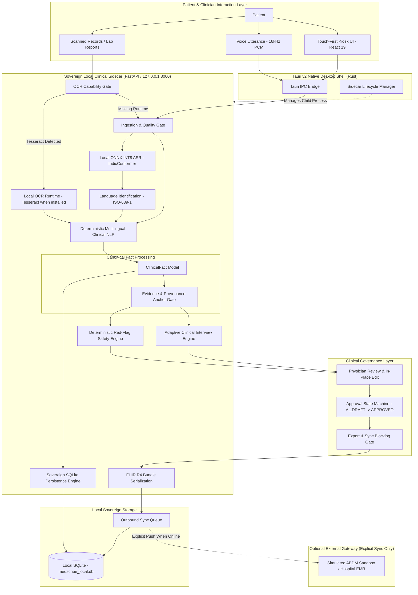

# MedScribeAI — System Architecture & Blueprint

**Document Version:** 2.0.0  
**Status:** Canonical Technical Specification  
**Scope:** Client Kiosk, Tauri Shell, FastAPI Clinical Sidecar, Sovereign SQLite Storage, FHIR R4 Serialization  

---

## 1. System Overview

MedScribeAI is an offline-first, sovereign clinical documentation and patient case-taking platform designed for low-connectivity primary care clinics, community health centers, and outpatient departments (OPDs).

The core design principle is **data sovereignty**: all sensitive clinical reasoning, speech processing, language identification, concept extraction, and persistence operate locally on the physical workstation without mandatory cloud dependencies.



---

## 2. Canonical Clinical Fact Architecture

To prevent conflicting data models across the application, MedScribeAI enforces a single, authoritative source of truth: `ClinicalFact`.

### 2.1 The ClinicalFact Schema

Every extracted medical observation must conform to the immutable `ClinicalFact` contract:

```python
class ClinicalFact(BaseModel):
    id: str = Field(..., description="Unique fact identifier (UUID)")
    category: FactCategory = Field(..., description="symptom | condition | medication | allergy | investigation | procedure | vital | ayush")
    concept_id: str = Field(..., description="Canonical concept code (e.g., SYM_CHEST_PAIN)")
    canonical_text: str = Field(..., description="Normalized English medical term")
    assertion: FactAssertion = Field(..., description="present | negated | uncertain | suspected | not_elicited")
    temporality: FactTemporality = Field(..., description="current | historical | future | unknown")
    experiencer: FactExperiencer = Field(..., description="patient | family_member | other")
    elicitation: FactElicitation = Field(..., description="patient_reported | clinician_observed | system_derived")
    confidence: float = Field(..., ge=0.0, le=1.0)
    evidence: str = Field(..., min_length=1, description="Verbatim text span supporting the fact")
    start_char: Optional[int] = None
    end_char: Optional[int] = None
    attributes: Dict[str, Any] = Field(default_factory=dict)
```

### 2.2 Strict Invariants

1. **Zero-Fabrication Invariant:** Missing clinical topics remain unasserted. The system never defaults unmentioned review-of-systems to negative findings (e.g., lack of fever mention results in no fever fact, NOT "fever: negated").
2. **Evidence Anchor Invariant:** Every fact emitted by the NLP pipeline must have a non-empty `evidence` attribute that exists as an exact substring within the source transcript or document.
3. **Negation Scope Integrity:** Negation cues (e.g., Hindi *"nahi hai"*, *"bina"*; English *"denies"*, *"no"*) bind strictly to concepts within their syntactic window and do not leak across contrastive conjunctions.
4. **Experiencer Attribution:** Statements referencing family members (e.g., *"My father had diabetes"*) are tagged with `experiencer: FAMILY` and cannot be projected into the patient's active medical problem list.

---

## 3. Local Sovereign AI Stack

### 3.1 Speech-to-Text (ASR)
- **Model:** `ai4bharat/indicconformer_stt_hi_hybrid_ctc_rnnt_large` (Sherpa-ONNX conversion by meetsync).
- **Quantization:** INT8 ONNX graph (`model.int8.onnx`, 187.85 MB).
- **Inference Runtime:** `onnxruntime` CPU Execution Provider (4 intra-op threads).
- **Sample Rate:** 16,000 Hz, 16-bit mono PCM.
- **Languages Supported by Model:** Assamese (`as`), Bengali (`bn`), Bodo (`brx`), Gujarati (`gu`), Hindi (`hi`), Kannada (`kn`), Kashmiri (`ks`), Marathi (`mr`).
- **Benchmark Status:** Technical runtime verified (median forward pass latency: 93.64 ms). Human acoustic WER/CER evaluation remains deferred pending representative physical clinical corpora.

### 3.2 Clinical NLP & Normalization
- **Implementation:** High-performance deterministic rule matching, morphological stemmers, and regex tokenizers.
- **Languages:** Hindi, Marathi, Gujarati, Tamil, English, and code-switched Hinglish.
- **Latency:** Median 0.24 ms per consultation utterance (Intel Core Ultra 5).
- **Performance:** 99.39% precision, 93.71% recall, 96.47% F1-score across 150 gold-standard test cases.

### 3.3 Safety & Red-Flag Engine
- **Implementation:** Pure deterministic logic in `app.safety.rules`. Never delegates emergency detection to non-deterministic generative models.
- **Latency:** < 0.01 ms.
- **Emergency Escalation:** Triggers clinical staff notifications for acute coronary symptoms, acute respiratory distress, severe hemorrhage, or altered consciousness.

---

## 4. State Machine & Human-in-the-Loop Governance

Clinical documentation follows an immutable, audit-logged state machine:

```
[AI_DRAFT] 
     │
     ▼  Physician opens review panel
[REVIEWING] 
     │
     ▼  Physician clicks "Approve Documentation"
[APPROVED] 
     │
     ├─► Material Edit Detected ──► Reverts to [REVIEWING] (Invalidates Prior Approval)
     │
     ▼  Export Action Executed
[EXPORTED]
```

### Governance Rules:
- **Prescription Gating:** Prescription slips cannot be printed while in `AI_DRAFT` or `REVIEWING`.
- **FHIR Export Gating:** FHIR R4 Bundles cannot be serialized or exported unless the encounter state is `APPROVED`.
- **Consent Gating:** If the patient has revoked or withheld hospital sharing consent (`hospitalSharing: false`), outbound network synchronization is permanently blocked regardless of approval status.

---

## 5. Local Relational Storage (SQLite)

Persistence is managed by `app.storage.database` using local SQLite with write-ahead logging (WAL):

- `encounters`: Manages consultation metadata, workflow states, and approval signatures.
- `clinical_facts`: Relational storage of all extracted `ClinicalFact` records.
- `fact_evidence`: Verbatim text spans and document offsets linked to each fact.
- `audit_log`: Immutable tamper-evident trail recording every user action with collision-proof millisecond UUIDs.
- `sync_queue`: Idempotent deferred queue for asynchronous synchronization upon network restoration.
